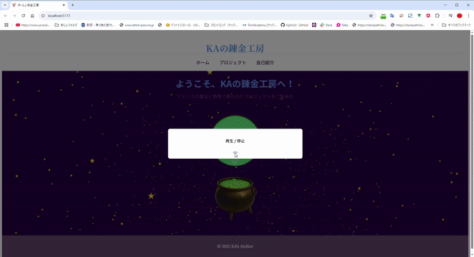
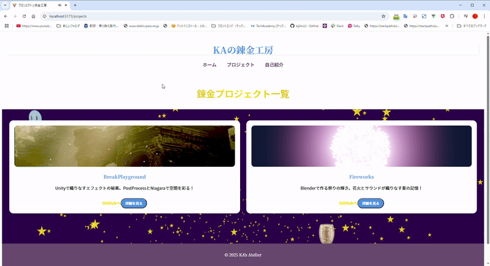
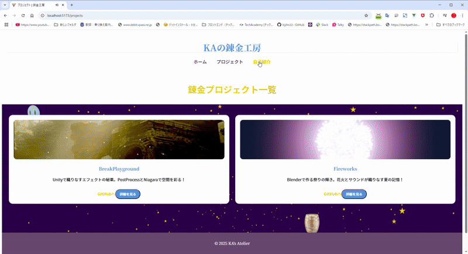

# Alchemist Sparkle ストーリーボード

## シーン 1: 工房の目覚めと星々の煌めき
### 描写:
- 錬金術工房の窓辺から柔らかな朝の光が差し込み、静けさが温かさに変わる。
- 作業台の上に星屑のような粉や魔法の道具が置かれており、光の粒子がゆっくりと宙に舞い始める。
- 同時に、夜空を思わせる背景が工房の一部を包み込み、小さな星々が回転しながら輝き、工房内に幻想的な空間を作り出す。

### アニメーション:

1. **窓辺の光と工房全体の描写**:
   - 窓からの柔らかな光が徐々に強まり、工房全体に命を吹き込むように広がる。
   - 作業台から微細な光の粒子が立ち上り、宙を舞う動きが続く（約3秒）。
2. **星々の広がり**:
    - 小さな星々がランダムに回転し、時折輝きが強まり弾ける（約5秒）。
    - 背景の星々がゆっくりと流れ、工房全体を包み込むように動く。
3. **錬金釜の光**:
    - 錬金釜から光の粒子が溢れ出し、工房内に柔らかな光を放つ（約2秒）。
    - 光の粒子が宙を舞いながら、工房全体に広がる。
### サウンド:
- 穏やかなピアノの調べに加え、透明感のあるベルの音が星々の動きに合わせて響く。
- 光の粒子の立ち上がりに合わせて静かに音量が上昇し、全体の調和を演出。

---

## シーン 2: プロジェクト一覧（ギャラリーシーン）
### 描写:
- 各プロジェクトが錬金術の瓶や魔法書の形で現れ、それぞれが柔らかな光を放ちながら整列。
- 工房の背景には浮遊する魔法の道具や巻物。

### アニメーション:

- プロジェクトアイコンが「瓶」に見立てられ、光の軌跡を描きながら浮かび上がる。
- 背景の道具や巻物がゆっくりと回転し、魔法の空間を演出。
- サウンド: 静かなパーカッションとハープの音色で軽やかさを演出。

---

## シーン 3: 自己紹介ページ（巻物の対話）
### 描写:
- 錬金術師KAのメッセージが巻物に記されている。
- 巻物が開き、優しく文字が浮かび上がる様子。

### アニメーション:

- 巻物がくるくると回転しながら画面中央に開く。
- メッセージが1文字ずつ浮かび上がるようなアニメーション。
- サウンド: 羽ペンで文字を書く効果音が徐々に加わる。

---
